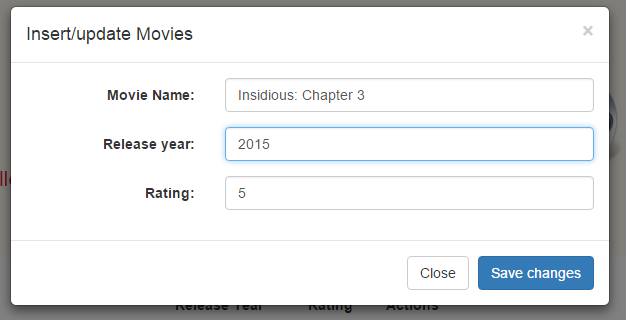

# My Movies App #

This is a simple application that has as purpose listing a list of Movies. Within the list there will be options to edit the Movie names and other fields such as the length, release year or rating it from 1-5. 

Movies can also be deleted, so an action to do so is added. Adding movies is also possible with the *Add New Movie* link. 

Technically, Ajax calls were implemented for each one of the possible actions so the user doesn't see the page refreshing. I use a PostgreSQL database with one simple table **Movies** that has, so far, an id (autoincrement), a name, that is text type, a rating that is an integer and a year that would be a field with 4 characters. 

Overall, Symfony2 was used as PHP framework and the base code is the one for the sample app provided in the framework website. I used Doctrine as ORM to map the table to a Movies object. Bower was integrated to the project for the improvements on the app, meaning, the installation of different extra libraries and utilities. I added Bootstrap to style the application as could be seen here:

JQuery was also included as part of the added libraries to create the event listeners. This was also possible with Vanilla JavaScript but for this time I used jQuery. For adding and updating Movies, I added a modal with a simple form, including the JQuery's validation plugin, it was possible processing only valid forms:

**Notes:** at work, the application is written using Zend Framework. This was actually the first time I was using Symfony2 and Doctrine but had good reasons for it. Zend Framework is very hard to setup and I'm not that good for solving those type of issues, regarding the DB connection, there were several classes written years ago to manage that, they even include lots of functions to query, insert, delete, etc and being the result of years of improvement, it was not a class that I could use. ORM eases the connection to the database and provides better abstractions for operations in the data layer.